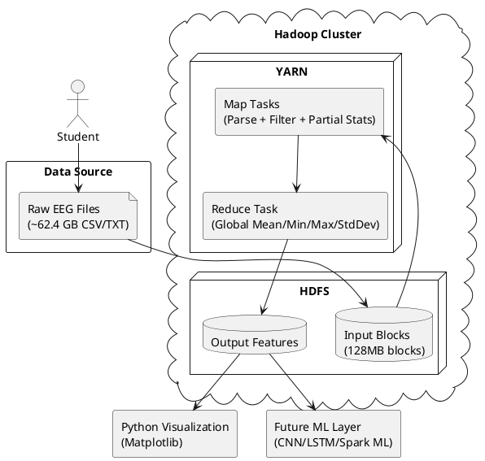

# Scalable Big Data Analytics for Epileptic Seizure Detection using Hadoop

This guide gives you a **complete, practical, end-to-end implementation** for a college project using the Hadoop ecosystem with large EEG data (~62.4 GB).

---

## 1) Environment Setup (Linux / WSL + Java + Hadoop 3.x)

> Recommended OS: Ubuntu 22.04 (native Linux or WSL2 on Windows)

### 1.1 Install Linux dependencies

```bash
sudo apt update
sudo apt install -y openssh-server openssh-client rsync curl wget vim
```

### 1.2 Install Java (JDK 11 preferred; JDK 8 also okay)

```bash
sudo apt install -y openjdk-11-jdk
java -version
javac -version
```

Set `JAVA_HOME`:

```bash
readlink -f /usr/bin/java
# Example output: /usr/lib/jvm/java-11-openjdk-amd64/bin/java

echo 'export JAVA_HOME=/usr/lib/jvm/java-11-openjdk-amd64' >> ~/.bashrc
echo 'export PATH=$PATH:$JAVA_HOME/bin' >> ~/.bashrc
source ~/.bashrc
```

### 1.3 Create Hadoop user (optional but clean)

```bash
sudo adduser hadoop
sudo usermod -aG sudo hadoop
su - hadoop
```

### 1.4 Setup SSH for Hadoop daemons

```bash
ssh-keygen -t rsa -P '' -f ~/.ssh/id_rsa
cat ~/.ssh/id_rsa.pub >> ~/.ssh/authorized_keys
chmod 600 ~/.ssh/authorized_keys
ssh localhost
```

### 1.5 Download and extract Hadoop 3.x

```bash
cd ~
wget https://downloads.apache.org/hadoop/common/hadoop-3.3.6/hadoop-3.3.6.tar.gz
tar -xzf hadoop-3.3.6.tar.gz
mv hadoop-3.3.6 hadoop
```

Add Hadoop env variables (`~/.bashrc`):

```bash
cat << 'EOT' >> ~/.bashrc
export HADOOP_HOME=$HOME/hadoop
export HADOOP_CONF_DIR=$HADOOP_HOME/etc/hadoop
export PATH=$PATH:$HADOOP_HOME/bin:$HADOOP_HOME/sbin
export HADOOP_MAPRED_HOME=$HADOOP_HOME
export HADOOP_COMMON_HOME=$HADOOP_HOME
export HADOOP_HDFS_HOME=$HADOOP_HOME
export YARN_HOME=$HADOOP_HOME
EOT

source ~/.bashrc
```

Edit `hadoop-env.sh`:

```bash
sed -i 's|^# export JAVA_HOME=.*|export JAVA_HOME=/usr/lib/jvm/java-11-openjdk-amd64|' $HADOOP_HOME/etc/hadoop/hadoop-env.sh
```

### 1.6 Configure Hadoop XML files

#### `core-site.xml`

```xml
<configuration>
  <property>
    <name>fs.defaultFS</name>
    <value>hdfs://localhost:9000</value>
  </property>
  <property>
    <name>hadoop.tmp.dir</name>
    <value>/home/hadoop/hadoop_tmp</value>
  </property>
</configuration>
```

#### `hdfs-site.xml`

```xml
<configuration>
  <property>
    <name>dfs.replication</name>
    <value>1</value>
  </property>
  <property>
    <name>dfs.namenode.name.dir</name>
    <value>file:///home/hadoop/hdfs/namenode</value>
  </property>
  <property>
    <name>dfs.datanode.data.dir</name>
    <value>file:///home/hadoop/hdfs/datanode</value>
  </property>
  <property>
    <name>dfs.blocksize</name>
    <value>134217728</value>
  </property>
</configuration>
```

#### `mapred-site.xml`

```xml
<configuration>
  <property>
    <name>mapreduce.framework.name</name>
    <value>yarn</value>
  </property>
</configuration>
```

> Create from template if needed:

```bash
cp $HADOOP_HOME/etc/hadoop/mapred-site.xml.template $HADOOP_HOME/etc/hadoop/mapred-site.xml
```

#### `yarn-site.xml`

```xml
<configuration>
  <property>
    <name>yarn.nodemanager.aux-services</name>
    <value>mapreduce_shuffle</value>
  </property>
  <property>
    <name>yarn.resourcemanager.hostname</name>
    <value>localhost</value>
  </property>
</configuration>
```

### 1.7 Format NameNode and start Hadoop

```bash
mkdir -p ~/hadoop_tmp ~/hdfs/namenode ~/hdfs/datanode
hdfs namenode -format
start-dfs.sh
start-yarn.sh
```

### 1.8 Verify installation

```bash
jps
# Expected daemons: NameNode, DataNode, SecondaryNameNode, ResourceManager, NodeManager

hdfs dfs -mkdir -p /user/hadoop
hdfs dfs -ls /
yarn node -list
```

---

## 2) Dataset Handling in HDFS (62.4 GB EEG)

> If your source files are **.edf**, first convert them to CSV using the included script, then upload CSV to HDFS.

### 2.0 Convert `.edf` to `.csv` (NEW)

Install EDF conversion dependency:

```bash
pip install pyEDFlib
```

Use script: `scripts/edf_to_csv.py`

```bash
python scripts/edf_to_csv.py \
  --input-dir /home/hadoop/eeg_edf \
  --output-dir /home/hadoop/eeg_dataset \
  --step 1
```

Output CSV schema used by MapReduce:

```text
timestamp,channel,value
```

- `timestamp`: seconds from recording start
- `channel`: EEG channel name from EDF metadata
- `value`: signal amplitude

> Tip for huge EDFs: set `--step 2` or `--step 4` to downsample export and reduce storage size for quick experiments.

After conversion, assume your EEG CSV files are in local folder:
Assume your EEG files are in local folder:

```bash
/home/hadoop/eeg_dataset/
```

### 2.1 Create HDFS directories

```bash
hdfs dfs -mkdir -p /projects/eeg/input
hdfs dfs -mkdir -p /projects/eeg/output
```

### 2.2 Upload large dataset

```bash
hdfs dfs -put /home/hadoop/eeg_dataset/* /projects/eeg/input/
```

### 2.3 Validate upload

```bash
hdfs dfs -ls /projects/eeg/input
hdfs dfs -du -h /projects/eeg/input
```

### How Hadoop stores large EEG files (Block concept)

- HDFS splits files into fixed-size blocks (here set to **128 MB**).
- 62.4 GB ≈ 62.4 × 1024 / 128 ≈ **499 blocks**.
- Blocks are distributed across DataNodes (single-node in lab setup; multi-node in production).
- MapReduce runs mappers close to block locations (data locality), improving performance.

---

## 3) Data Preprocessing with MapReduce (Java)

The provided program does:
- Reads EEG CSV/text rows.
- Ignores malformed/header rows.
- Filters unrealistic values outside [-10000, 10000].
- Computes global features:
  - Mean
  - Min
  - Max
  - Standard Deviation

### Java file

Use: `src/main/java/org/eeg/EEGFeatureExtraction.java`

```java
package org.eeg;

import java.io.IOException;
import java.util.StringTokenizer;

import org.apache.hadoop.conf.Configuration;
import org.apache.hadoop.fs.Path;
import org.apache.hadoop.io.DoubleWritable;
import org.apache.hadoop.io.LongWritable;
import org.apache.hadoop.io.Text;
import org.apache.hadoop.mapreduce.Job;
import org.apache.hadoop.mapreduce.Mapper;
import org.apache.hadoop.mapreduce.Reducer;
import org.apache.hadoop.mapreduce.lib.input.FileInputFormat;
import org.apache.hadoop.mapreduce.lib.output.FileOutputFormat;

/**
 * EEG Feature Extraction using Hadoop MapReduce.
 *
 * Input format (CSV or text):
 *   timestamp,channel,value
 *   OR any row where last numeric token is treated as EEG signal value.
 *
 * Output format:
 *   GLOBAL\tcount,mean,min,max,stddev
 */
public class EEGFeatureExtraction {

    private static final double MIN_VALID = -10000.0;
    private static final double MAX_VALID = 10000.0;

    /** Mapper emits partial statistics for each valid EEG value. */
    public static class EEGMapper extends Mapper<LongWritable, Text, Text, Text> {
        private static final Text GLOBAL_KEY = new Text("GLOBAL");

        @Override
        public void map(LongWritable key, Text value, Context context)
                throws IOException, InterruptedException {

            String line = value.toString().trim();
            if (line.isEmpty()) {
                return;
            }

            // Skip header rows that contain alphabetic characters in key columns.
            if (line.toLowerCase().contains("timestamp") || line.toLowerCase().contains("channel")) {
                return;
            }

            Double eegValue = extractSignalValue(line);
            if (eegValue == null) {
                return;
            }

            if (eegValue < MIN_VALID || eegValue > MAX_VALID) {
                return;
            }

            // Emit tuple: count,sum,min,max,sumSquares
            double v = eegValue;
            String partial = String.format("1,%.10f,%.10f,%.10f,%.10f", v, v, v, v * v);
            context.write(GLOBAL_KEY, new Text(partial));
        }

        /**
         * Extract EEG value from line.
         * Strategy:
         * 1) If comma-separated, parse the last column as double.
         * 2) Else parse the last whitespace-delimited token.
         */
        private Double extractSignalValue(String line) {
            try {
                if (line.contains(",")) {
                    String[] cols = line.split(",");
                    String last = cols[cols.length - 1].trim();
                    return Double.parseDouble(last);
                } else {
                    StringTokenizer tokenizer = new StringTokenizer(line);
                    String last = null;
                    while (tokenizer.hasMoreTokens()) {
                        last = tokenizer.nextToken();
                    }
                    if (last != null) {
                        return Double.parseDouble(last.trim());
                    }
                }
            } catch (NumberFormatException ex) {
                // Ignore malformed numeric rows.
            }
            return null;
        }
    }

    /** Reducer aggregates all partial stats and computes final global features. */
    public static class EEGReducer extends Reducer<Text, Text, Text, Text> {

        @Override
        public void reduce(Text key, Iterable<Text> values, Context context)
                throws IOException, InterruptedException {

            long count = 0L;
            double sum = 0.0;
            double min = Double.MAX_VALUE;
            double max = -Double.MAX_VALUE;
            double sumSquares = 0.0;

            for (Text t : values) {
                String[] parts = t.toString().split(",");
                if (parts.length != 5) {
                    continue;
                }

                long c = Long.parseLong(parts[0]);
                double s = Double.parseDouble(parts[1]);
                double mn = Double.parseDouble(parts[2]);
                double mx = Double.parseDouble(parts[3]);
                double ss = Double.parseDouble(parts[4]);

                count += c;
                sum += s;
                min = Math.min(min, mn);
                max = Math.max(max, mx);
                sumSquares += ss;
            }

            if (count == 0) {
                context.write(key, new Text("0,NaN,NaN,NaN,NaN"));
                return;
            }

            double mean = sum / count;
            double variance = (sumSquares / count) - (mean * mean);
            if (variance < 0) {
                variance = 0; // Numeric safety for floating-point errors.
            }
            double stddev = Math.sqrt(variance);

            String result = String.format("%d,%.6f,%.6f,%.6f,%.6f", count, mean, min, max, stddev);
            context.write(key, new Text(result));
        }
    }

    /** Driver class to configure and run MapReduce job. */
    public static void main(String[] args) throws Exception {
        if (args.length != 2) {
            System.err.println("Usage: EEGFeatureExtraction <input_hdfs_path> <output_hdfs_path>");
            System.exit(2);
        }

        Configuration conf = new Configuration();
        Job job = Job.getInstance(conf, "EEG Feature Extraction");
        job.setJarByClass(EEGFeatureExtraction.class);

        job.setMapperClass(EEGMapper.class);
        job.setReducerClass(EEGReducer.class);

        job.setMapOutputKeyClass(Text.class);
        job.setMapOutputValueClass(Text.class);
        job.setOutputKeyClass(Text.class);
        job.setOutputValueClass(Text.class);

        FileInputFormat.addInputPath(job, new Path(args[0]));
        FileOutputFormat.setOutputPath(job, new Path(args[1]));

        System.exit(job.waitForCompletion(true) ? 0 : 1);
    }
}
```

---

## 4) Compilation and Execution

From project root:

```bash
export HADOOP_CLASSPATH=$(hadoop classpath)
mkdir -p build

javac -classpath "$HADOOP_CLASSPATH" -d build src/main/java/org/eeg/EEGFeatureExtraction.java
jar -cvf eeg-feature-extraction.jar -C build .
```

Run MapReduce job:

```bash
hdfs dfs -rm -r -f /projects/eeg/output/features

hadoop jar eeg-feature-extraction.jar org.eeg.EEGFeatureExtraction \
    /projects/eeg/input \
    /projects/eeg/output/features
```

Track job in web UI:
- YARN UI: `http://localhost:8088`
- NameNode UI: `http://localhost:9870`

---

## 5) Output Analysis for Seizure Detection

View output files:

```bash
hdfs dfs -ls /projects/eeg/output/features
hdfs dfs -cat /projects/eeg/output/features/part-r-00000
```

Expected output format:

```text
GLOBAL  123456789,12.345678,-98.765432,110.123456,22.334455
```

Interpretation (basic):
- **High standard deviation** may indicate unstable neural activity.
- **Extreme min/max spikes** may correspond to artifact bursts or seizure-related abnormalities.
- **Mean drift** across windows can indicate baseline shifts.

> For seizure detection, run this per patient/session/window and compare normal vs seizure episodes.

---

## 6) Full Architecture + PlantUML

Pipeline:

**EEG Data (Raw CSV) → HDFS Storage → MapReduce Feature Extraction → Output Features → Visualization / ML**

PlantUML:



---

## 7) Optional High-Marks Extension

### 7.1 Python visualization script

Use file: `scripts/visualize_eeg_features.py`

Run:

```bash
# Download MapReduce result locally
hdfs dfs -get /projects/eeg/output/features/part-r-00000 eeg_features_output.txt

# Install dependencies
pip install matplotlib

# Generate plot
python scripts/visualize_eeg_features.py --input eeg_features_output.txt --output-dir plots
```

### 7.2 Project extension ideas

#### A) Move from MapReduce to Spark
- Use PySpark DataFrames for faster iterative operations.
- Compute sliding-window features per channel.
- Add FFT/bandpower features (delta, theta, alpha, beta, gamma).

#### B) Add Machine Learning
- Start with classical ML: Random Forest / XGBoost on extracted features.
- Then deep learning:
  - **1D CNN** for local temporal patterns.
  - **LSTM/BiLSTM** for long-range sequence dependencies.
- Use patient-wise split to avoid data leakage.

#### C) Production-oriented upgrades
- Multi-node Hadoop cluster (3+ nodes, replication 3).
- Store derived features in Hive tables.
- Build Airflow pipeline for automated periodic retraining.

---

## 8) Viva Preparation: 10 Common Questions + Answers

1. **What problem does HDFS solve for EEG data?**  
   It stores very large datasets by splitting files into blocks and distributing them across nodes, enabling parallel processing and fault tolerance.

2. **Why use MapReduce for this project?**  
   MapReduce processes huge files in parallel and is suitable for scalable batch feature extraction from EEG signals.

3. **What is data locality in Hadoop?**  
   Computation is moved near where data blocks are stored, reducing network transfer and improving speed.

4. **Why do we filter EEG values before feature extraction?**  
   To remove invalid/corrupted/outlier readings that can distort mean and standard deviation.

5. **How is standard deviation useful for seizure detection?**  
   Seizure periods often show abrupt signal variation; higher standard deviation can indicate abnormal activity.

6. **Difference between NameNode and DataNode?**  
   NameNode manages HDFS metadata; DataNodes store actual data blocks.

7. **Why set replication factor to 1 in this project?**  
   For single-node lab setup to save storage. In production, replication 3 is preferred for fault tolerance.

8. **How would you improve this pipeline for real-time seizure alerts?**  
   Replace batch MapReduce with Spark Streaming/Flink + Kafka and deploy online model inference.

9. **What are limitations of global features?**  
   They lose temporal and channel-specific detail. Better to compute window-wise and channel-wise features.

10. **How can you prevent ML data leakage in medical EEG?**  
    Use patient-level splits (train/test by subject) and strict temporal separation when needed.

---

## 9) Quick End-to-End Command Checklist

```bash
# 1) Start services
start-dfs.sh
start-yarn.sh
jps

# 2) Upload EEG data
# (optional) If dataset is EDF, convert first:
pip install pyEDFlib
python scripts/edf_to_csv.py --input-dir /home/hadoop/eeg_edf --output-dir /home/hadoop/eeg_dataset --step 1

# 3) Upload EEG CSV data
hdfs dfs -mkdir -p /projects/eeg/input
hdfs dfs -put /home/hadoop/eeg_dataset/* /projects/eeg/input/

# 4) Build job
hdfs dfs -mkdir -p /projects/eeg/input
hdfs dfs -put /home/hadoop/eeg_dataset/* /projects/eeg/input/

# 3) Build job
export HADOOP_CLASSPATH=$(hadoop classpath)
mkdir -p build
javac -classpath "$HADOOP_CLASSPATH" -d build src/main/java/org/eeg/EEGFeatureExtraction.java
jar -cvf eeg-feature-extraction.jar -C build .

# 5) Run job
hdfs dfs -rm -r -f /projects/eeg/output/features
hadoop jar eeg-feature-extraction.jar org.eeg.EEGFeatureExtraction /projects/eeg/input /projects/eeg/output/features

# 6) Check output
hdfs dfs -cat /projects/eeg/output/features/part-r-00000

# 7) Visualize
# 4) Run job
hdfs dfs -rm -r -f /projects/eeg/output/features
hadoop jar eeg-feature-extraction.jar org.eeg.EEGFeatureExtraction /projects/eeg/input /projects/eeg/output/features

# 5) Check output
hdfs dfs -cat /projects/eeg/output/features/part-r-00000

# 6) Visualize
hdfs dfs -get /projects/eeg/output/features/part-r-00000 eeg_features_output.txt
python scripts/visualize_eeg_features.py --input eeg_features_output.txt --output-dir plots
```

You now have a complete, runnable Hadoop-based EEG big-data analytics pipeline suitable for implementation and viva.
